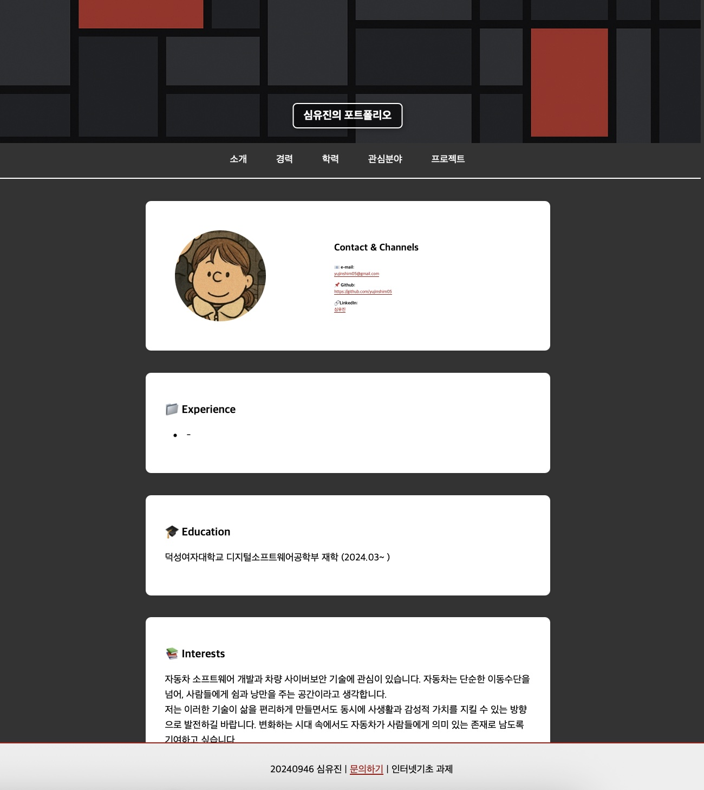

# yujinshim05 포트폴리오 페이지 

## 개요
덕성여자대학교 디지털소프트웨어공학부 2학년에 재학 중인 심유진의 개인 포트폴리오 웹사이트입니다.  
해당 페이지는 HTML과 CSS를 기반으로 제작되었으며 시맨틱 구조와 웹 폼 구현, 구글 스프레드시트 연동 등 다양한 요소를 포함하고 있습니다. 

### 포트폴리오는 다음의 섹션들로 구성되어 있습니다:

- **Contact & Channels** : 이메일, 깃허브, 링크드인 채널 정보
- **경력사항 (Experience)** : 현재까지의 경력 또는 학교 및 외부 활동
- **학력 (Education)** : 재학 중인 학교 정보
- **관심분야 (Interests)** : 관심 연구와 향후 계획
- **프로젝트 (Projects)** : 개인 프로젝트 소개, 대표 이미지와 상세 링크 포함
- **문의하기 (form.html)** : 다양한 입력 요소와 구글 스프레드시트 연동된 폼

---

## Contact & Channels

공유 가능한 개인 연락처 및 개발 채널은 다음과 같습니다:

- 이메일 : yujinshim05@gmail.com  
- GitHub : [https://github.com/yujinshim05](https://github.com/yujinshim05)  
- LinkedIn : [https://www.linkedin.com/in/yujinshim548/](https://www.linkedin.com/in/yujinshim548/)

---

## 기술 스택 및 구현 요소

- HTML5 시맨틱 마크업 구조 사용 (`<header>`, `<section>`, `<footer>` 등)
- CSS3로 디자인, 반응형 요소 일부 포함
- 프로젝트 정보는 `<table>` 요소로 구성되며, 이미지 클릭 시 상세 페이지로 이동
- 폼 페이지(form.html)는 `<fieldset>` 구조로 분리되며,  
  텍스트 입력, 이메일 검증, datalist, 라디오 버튼, 체크박스, 콤보박스 등 총 7가지 이상의 입력 요소 포함
- 제출된 정보는 **Google Apps Script**와 연동된 **스프레드시트로 자동 전송**

---

## 배포 주소

해당 포트폴리오 웹사이트는 GitHub Pages를 통해 배포되었습니다.  
아래 링크에서 확인하실 수 있습니다.

▶ [포트폴리오 웹사이트 보기](https://yujinshim05.github.io/)

---

## 기타 안내

- 해당 저장소는 개인 포트폴리오 및 과제 제출용으로 구성되었으며,
  추후 다른 수업 또는 포트폴리오 확장 시 기반으로 활용될 수 있도록 구성하였습니다.

---

감사합니다.